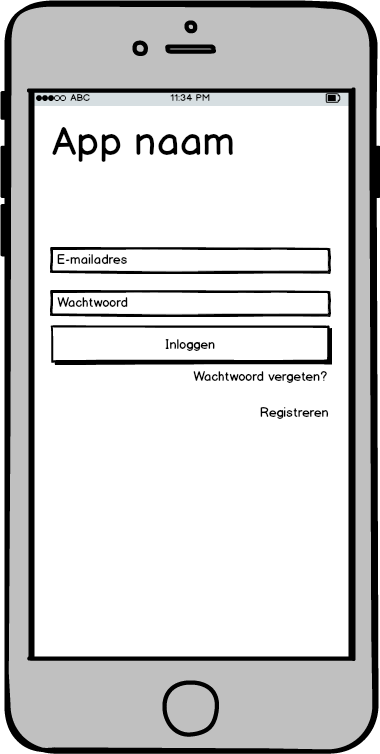
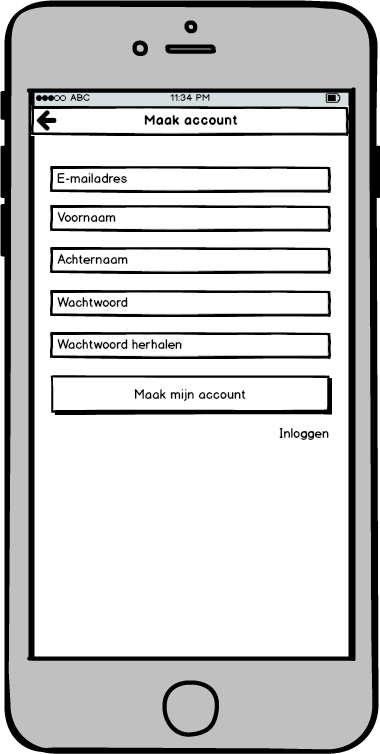
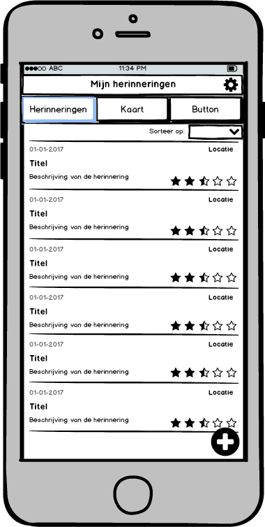
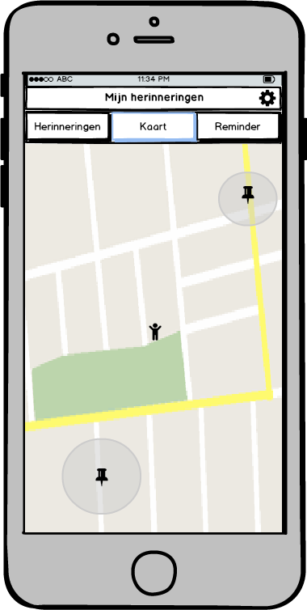
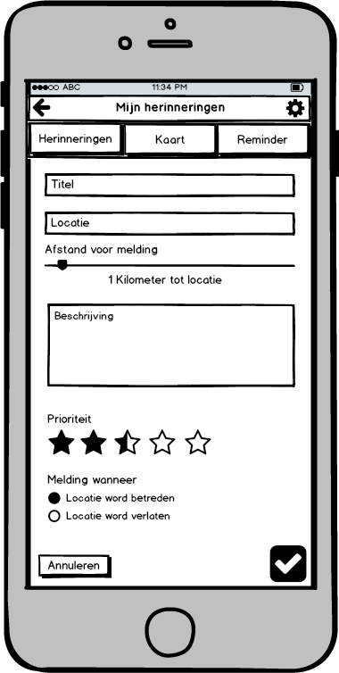

#Design document

##LoginActivity
Wanneer de applicatie voor de eerste keer word geopend of wanneer de gebruiker is uitgelogd word de LoginActivity geladen bij het openen van de applicatie. Als de gebruiker een account heeft kan hier worden ingelogd met de inloggegevens. Als de gebruiker nog geen account heeft moet er eerst een account worden aangemaakt. Hiervoor staat er een link onder het formulier die de gebruiker doorverwijst naar de RegisterActivity. Wanneer de gebruiker hun wachtwoord is vergeten kan de gebruiker ook op een link klikken waarna deze word doorverwezen naar de LostPasswordActivity. Als de gebruiker de juiste gegevens invoert logged deze in met de authenticatie feature van firebase en word deze doorverwezen naar de ReminderActivity.

##RegisterActivity
In de RegisterActivity kan de gebruiker een account aanmaken door een e-mail, voornaam, achternaam en wachtwoord in te voeren.  Als alle gegevens kloppen en er is niet een bestaand e-mail ingevoerd zal het account worden aangemaakt door de authenticatie feature van firebase en word de gebruiker doorverwezen naar de ReminderActivity. Wanneer dit fout gaat blijft de gebruiker op de Registeractivity waar er vervolgens word aangegeven wat er fout is gegaan. Wanneer de gebruiker al een account heeft kan deze op een link klikken onder het formulier om terug naar de LoginActivity te gaan.

##ReminderListActivity
Als de gebruiker is ingelogd komt deze op de ReminderListActivity terecht. Hier staan alle items die de gebruiker heeft toegevoegd weergegeven in een lijst (listview). Deze reminders worden opgehaald uit de firebase database en weergegeven in een listview. Hier kan de gebruiker een item selecteren om deze te bekijken en eventueel aan te passen in de database. De toegevoegde reminders kunnen op verschillende manieren worden gesorteerd boven de lijst. De gebruiker kan op de imagebutton onderaan het scherm klikken om zo een nieuw item toe te voegen aan de lijst. Dit betekent dus dat een nieuw scherm word geopend met de AddReminderActivity. In het menu bovenaan het scherm kan de gebruiker op map klikken om doorgestuurd te worden naar de MapActivity. Ook is er een instellingen icoon rechtsboven in het scherm om de gebruiker door te sturen naar de SettingsActivity.

##MapActivity
Naast de Reminder Activity kan de gebruiker zijn/haar reminders ook terug zien in de MapActivity op een interactieve kaart. Hier zullen de reminders op basis van hun locatie worden weergegeven door middel van een pointer. De map zal worden ingeladen samen met de reminders die in de database staan. Ook zal de radius van een reminder zichtbaar zijn zodat de gebruiker kan zien hoe groot de daadwerkelijke afstand tot de locatie moet zijn om een melding te laten verschijnen. Ook kan de gebruiker natuurlijk zien waar hij zich bevind op de kaart. In het menu kan de gebruiker weer terug schakelen naar de ReminderActivity of doorschakelen naar de SettingsActivity.

##AddReminderActivity
De gebruiker komt op dit scherm wanneer hij of zei een reminder wilt toevoegen of een reminder wilt aanpassen.  Hier kan de gebruiker alle informatie invoeren in een formulier. Bij titel kan de gebruiker een naam voor de activiteit invoeren. Bij Locatie kan een gebruiker zoeken naar locaties die voldoen aan de zoekopdracht in het betreffende invoerveld. De locaties zullen worden opgehaald uit de Google places API. Daaronder kan de gebruiker aangeven hoe ver er vanaf de locatie een melding word weergegeven. Bij de beschrijving kan de gebruiker meer informatie invoeren indien dat nodig is. Ook moet er worden aangegeven wanneer er een melding moet verschijnen. Dit kan zijn wanneer de gebruiker de radius van de locatie betreed, verlaat, beiden of helemaal niet. Dit alles zal worden opgeslagen in een ReminderObject door gebruik van een class. Wanneer de gebruiker op de bevestig button klikt zal het complete object doorgestuurd worden naar de firebase database.

##GpsReminderActivity – Asynctask
Bij elke activity Moet er de asynctask GpsReminderActivity op de achtergrond uitgevoerd worden ten alle tijden. Ook moet deze activity zijn werk doen wanneer de app op de achtergrond draait en zelfs wanneer de applicatie volledig is afgesloten. Deze activity kijkt naar de GPS locatie van de telefoon en kijkt of deze in de radius is van 1 van de locaties van de reminders die door de gebruikers zijn ingevoerd. Wanneer dit het geval is zal er een melding worden gestuurd naar de activity die op dat moment is geopend. Als de applicatie niet is geopend zal de activity een push notificatie sturen. 
 

API’s and frameworks:
*	Firebase platform
*	Google Maps Android API
*	Google Places API for Android

Lijst van firebase tabellen
+	Gebruikers ID
 +	E-mail
 +	Naam
 +	Reminders
   +	ID
   +	Titel
   +	Locatie 
   +	Beschrijving
   +	Prioriteit
   +	Melding trigger 

De database feature van firebase heeft geen standaard tabellen zoals een SQl database maar maakt gebruik van een boomstructuur. Zodra er een nieuwe gebruiker zich registreert word er een nieuwe tak toegevoegd met een e-mail en naam onder een uniek gebruikers ID. zodra deze nieuwe gebruiker een herinnering toevoegt word de tak ‘reminders’ toegevoegd met alle subtakken die de informatie bevatten.
