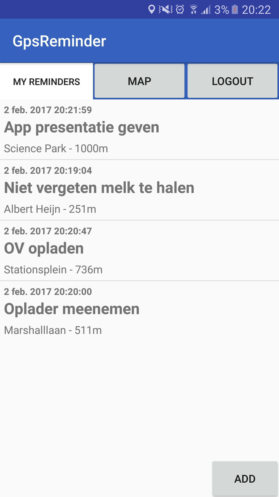

# RikvanToorn-Programmeerproject
Applicatie voor het Programmeerproject van Rik van Toorn, 11279184

## GpsReminder
GpsReminder geeft gebruikers de mogelijkheid een herinnering te koppelen aan bepaalde locaties. De gebruiker kan een account registreren en daarmee in te loggen om zo een persoonlijke lijst van Reminders bij te houden. De gebruiker kan een herinnering toevoegen en daarmee bepaalde informatie meegeven zoals de titel van de herinnering, de locatie en de afstand tot de locatie wanneer de herinnering (notificatie) moet worden verstuurd. Herinneringen kunnen natuurlijk worden verwijderd en aangepast naar de wens van de gebruiker. de gebruiker kan de herinneringen terugzien in een lijst of op een map.

##copyright statement
zie LICENSE.md
