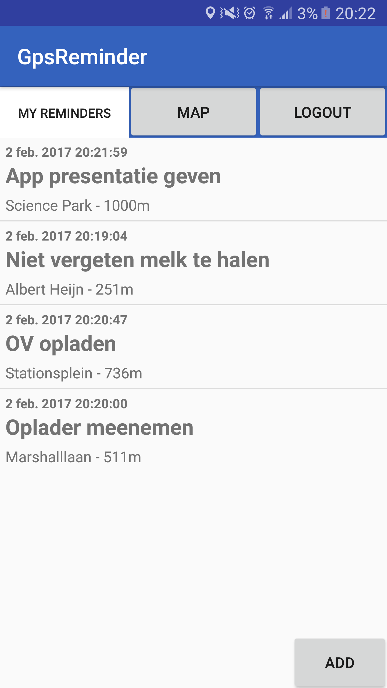

#Final report

##Beschrijving van de applicatie
GpsReminder geeft gebruikers de mogelijkheid een herinnering te koppelen aan bepaalde locaties. De gebruiker kan een account registreren en daarmee in te loggen om zo een persoonlijke lijst van Reminders bij te houden. De gebruiker kan een herinnering toevoegen en daarmee bepaalde informatie meegeven zoals de titel van de herinnering, de locatie en de afstand tot de locatie wanneer de herinnering (notificatie) moet worden verstuurd. Herinneringen kunnen natuurlijk worden verwijderd en aangepast naar de wens van de gebruiker. de gebruiker kan de herinneringen terugzien in een lijst of op een map.

##technisch design
Wanneer de applicatie voor de eerste keer wordt geopend wordt de login-activity geopend. Hier wordt het inloggen geregeld met een feature van Firebase. De gebruiker kan zijn gegevens invoeren waarna deze worden opgestuurd naar Firebase. Wanneer de gegevens kloppen wordt de gebruiker automatisch ingelogd en wordt deze doorgestuurd naar de Reminder-list-activity. Op deze activity kan de gebruiker al zijn reminders bekijken en deze in meer detail bekijken wanneer een reminder wordt geselecteerd. Ook kan de gebruiker hier een nieuwe Reminder toevoegen. Als de 'add' button wordt aangeklikt gaat de gebruiker naar een nieuwe activity, de reminder-add-activity. 
Deze activity bestaat uit een formulier die de gebruiker kan invullen zodat de reminder met juiste informatie, op de juiste plek en op het juiste moment wordt verstuurd naar de telefoon. Wanneer het formulier volledig is ingevuld en er weer op 'add' geklikt wordt dan worden deze gegevens met de hulp van de Reminder.class in zijn geheel in de database gezet van Firebase. Naast de reminder-list-activity kan de gebruiker zijn opgeslagen reminders terugzien in de map-activity. Op de map van Google die hier is ingeladen staan alle reminders die de gebruiker heeft toegevoegd. De laatste belangrijke activity is de reminder-activity. In deze activity staat de reminder die is geselecteerd in de reminder-list-activity. De gegevens worden doorgestuurd vanuit de Reminder-list-activity en op de textviews worden ingevuld met deze informatie. Vanuit hier kan de gebruiker de reminder verwijderen of ervoor kiezen deze aan te passen.

##Process, uitdagingen en keuzes
De belangrijkste functionaliteiten worden allemaal geregeld op de achtergrond van de applicatie. De zogenaamde Gps-service class wordt gestart wanneer de gebruiker is ingelogd en zal altijd op de achtergrond  blijven lopen. In deze service class wordt om de zoveel tijd de locatie opgevraagd van de mobiele telefoon en vervolgens vergeleken met alle locaties van de reminders die in de database staan opgeslagen. Wanneer het verschil kleiner is dan de maximale afstand die bij de reminders is ingevoerd wordt er gekeken wanneer de gebruiker de reminder wilt ontvangen (bij het betreden, verlaten van het gebied of allebei). Zodra alles klopt zal deze service een notificatie sturen naar de telefoon van de gebruiker. Ook wanneer deze volledig is afgesloten. Als de gebruiker op deze notificatie klikt zal de Reminder-activity worden geopend en kan de gebruiker zien waar hij zichzelf aan wilde herinneren. De gebruiker kan in de notificatie zelf ook snel zien welke reminder er is binnen gekomen.

In de eerste 2 weken ben ik tegen weinig grote problemen aangelopen. Dit komt omdat in in deze weken bezig ben geweest met het design en met alle handelingen tussen mijn applicatie en Firebase. Omdat ik al eerder deze dingen werkend heb gekregen ging dit vrij makkelijk. Dit zijn dingen zoals het registreren en inloggen door Firebase en het invoeren van de reminders in de database. Ook wilde ik gebruik maken van de Google maps API en de Google places API. Hiervan is gelukkig een uitgebreide documentatie van beschikbaar. De kaart van de google maps API was zo geïmplementeerd en ook de google paces API was erg simpel waardoor ik makkelijk een locatie ermee kan zoeken en daarvan de naam en coördinaten van kon ophalen om in de database van firebase te plaatsen.  Ik liep echter wel tegen een wat groter probleem aan aan het einde van week 2 wanneer ik de reminders weer wilde ophalen. Een reminder object bestaat uit verschillende variabelen zoals Strings, Integers en een LatLng object. Hierdoor kreeg ik problemen omdat ik niet wist dat je voor elke soort variabele een aparte map voor het datasnapshot moest maken. Nadat ik over dit obstakel was heen gekomen ging het maken van een custom adapter vanzelf en kon ik alles netjes in een listview laten zien. Ik heb gelijk besloten dat het toevoegen van een prioriteit van een reminder overbodig is en het daarom maar weg te laten. 

Nadat alles met firebase perfect werkte was het tijd om aan de belangrijkste functionaliteit van de applicatie te beginnen. Dit was het ophalen van de Gps locatie van de mobiele telefoon en deze vergelijken met de locaties uit de database. Om gebruik te kunnen maken van de Gps-locatie moet de gebruiker om toestemming worden gevraagd en hier had ik nogal moeite mee. Het probleem was vooral een foutmelding die eigenlijk niet kon worden opgelost en ik heb veel tijd verspilt tot ik er achter kwam dat je deze foutmelding kon negeren en de applicatie gewoon gestart kon worden. Nadat ik succesvol de locatie kon ophalen moest ik nog een manier verzinnen om deze te vergelijken met die uit de database. Na wat zoeken kwam ik een methode tegen in het location-object die de afstand tussen 2 LatLng objecten in meters berekende. Het resultaat van deze methode kon ik dan weer vergelijken met de 'maximale-afstand' van de bijhorende gebruiker waarna ik dus een actie kon laten uitvoeren. Het plan was dat hierna dus een notificatie werd verstuurd naar de gebruiker.

Dit alles heb ik getest in de Mapactivity maar het was natuurlijk de bedoeling dat deze functionaliteit op alle activiteiten werkt en ook wanneer de applicatie op de achtergrond draait of wanneer deze volledig is afgesloten. Na wat dingen geprobeerd te hebben en een zoektocht op Google kwam ik bij het concept van een service. Een service doet precies wat ik nodig had. Wanneer een service wordt gestart blijft hij draaien op de achtergrond zowel wanneer de applicatie is geopend bij iedere activity en ook wanneer de applicatie volledig is afgesloten. Ik kon de code die de locatie van het mobiele apparaat vergelijkt met de locaties uit de database min of meer kopiëren  naar de service. Een probleem dat ik nog wel tegen kwam was dat het vragen om toestemming voor het gebruik van de Gps-locatie aan de gebruiker hier niet in kon worden verwerkt en dus apart in een activity moest worden gedaan. Ik heb ervoor gekozen dit te doen in de Reminder-list-activity, oftewel wanneer de gebruiker voor de eerste keer inlogt. 

Wanneer de service detecteert dat de gebruiker dichtbij genoeg een locatie waar een reminder aan is verbonden moet er een notificatie worden verstuurd want dit is cruciaal voor de applicatie om het probleem van de gebruiker op te lossen. Gelukkig bestaat er voor dit een duidelijke en uitgebreide documentatie dus na een korte tijd was het versturen van een notificatie al werkend. Iets lastiger was het openen van de juiste activity wanneer de gebruiker de notificatie selecteert. Naast dat de juiste activiteit moest worden geopend moet ook de juiste gegevens worden meegestuurd om weer te geven in de activiteit. Na wat zoeken kwam ik bij een video tutorial die dit perfect demonstreerde en hierna kreeg ik het vrij snel werkend. Het Minimum viable product is op dit moment af. 

Naast dat de locaties in een lijst moeten worden weergeven wilde ik ze natuurlijk ook laten zien op een kaart. De Google maps api had ik al werkend dus het was enkel een kwestie van de locaties weer inladen vanuit de database en hier markers aan te verbinden en weer te geven op de kaart. Ook was het erg simpel om hier een radius aan toe te voegen zodat de gebruiker kan zien in welk gebied hij moet zijn om de notificatie binnen te krijgen. Toen was het tijd om de code te refractoren zodat alle firebase handelingen in een apart bestand kon worden geplaatst voor de seperation of concerns. Dit is me helaas niet gelukt door een voor mij onoplosbaar probleem (in de tijd die ik nog had) omdat firebasehandelingen asynscroon zijn en daardoor steeds een lege variable returnde. Ik heb hierdoor besloten
de handelingen maar in de activiteit of service te laten waar deze van toepassing is.

Als ik meer tijd had gehad dan was mijn eerste prioriteit geweest om de handelingen van firebase is een apart bestand te plaatsen voor een stuk schonere code. Verder zijn er nog genoeg functionaliteiten die ik had kunnen toevoegen als ik meer tijd had gehad. Deze zijn als volgt en in willekeurige volgorde:
*Optie om op de kaart een locatie te selecteren en hier gelijk een reminder aan toe te voegen
*Reminders een prioriteit meegeven
*Optie om de listview op andere manieren te sorteren zoals op prioriteit, title of afstand tot locatie
*De optie om een reminder op 'voltooid' te kunnen zetten maar wel in de database te laten
*De optie om een reminder vanzelf te verwijderen wanneer deze niet voltooid is voor een bepaalde datum
*De kaart live laten updaten wanneer de gebruiker de mapactivity open heeft en in beweging is
*De optie om reminders alleen tussen bepaalde tijdstippen te weergeven
